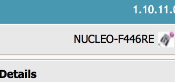
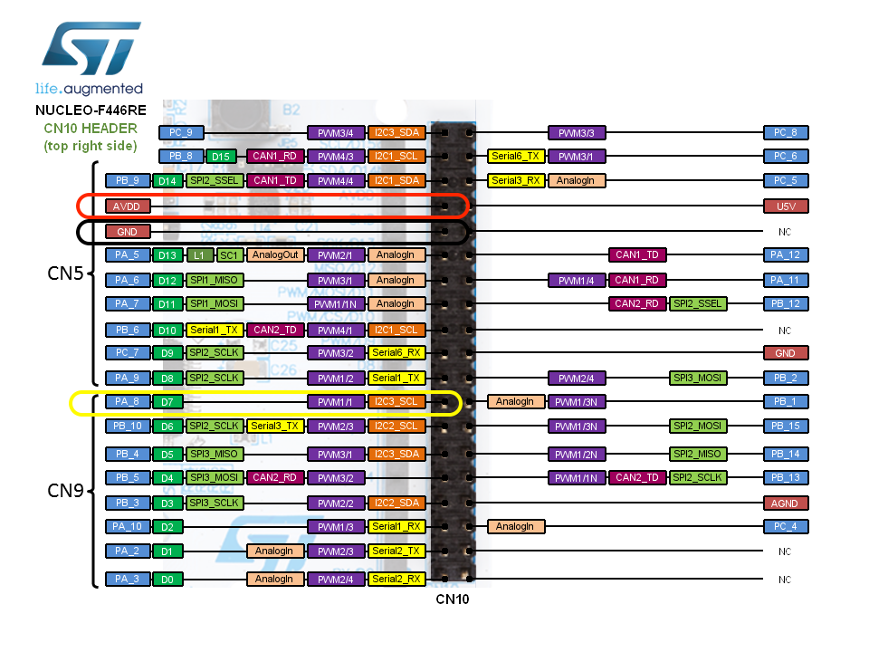
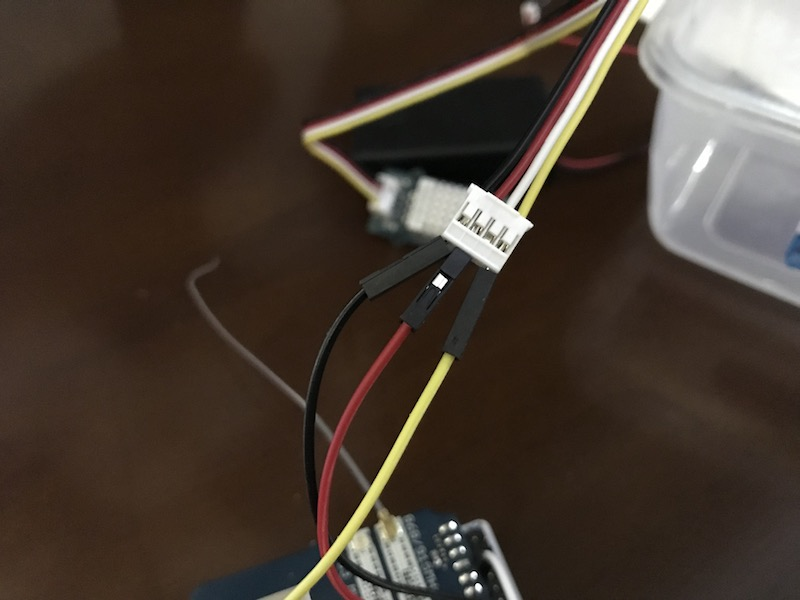

# DSA 2018 Abuja - IoT Practical Session

In this session we will develop four programs using the Mbed OS online compiler described in the lecture and deploy them on the [NUCLEO F446RE](https://os.mbed.com/platforms/ST-Nucleo-F446RE/) board.

The three applications are
1. The hardware hello world program *Blinky* that turns an LED on and off.
1. Temperature and humidity sensor
1. Motion detection
1. Data transmission using LoRaWAN

## Hardware requirements
1. NUCLEO-F446RE
1. LoRaWAN Transciever Shield (Custom made for DSA by ARM!)
1. USB Connector
1. Temperature sensor
1. Motion sensor


## Set Up

Follow these instructions from DSA 2018 Nyeri by Jan Jongboon to set up. Refer to the original repo [here](https://github.com/janjongboom/dsa2018-greenhouse-monitor).

1. Sign up for an Mbed account [https://os.mbed.com](https://os.mbed.com).
1. Go to the [NUCLEO-F446RE](https://os.mbed.com/platforms/ST-Nucleo-F446RE/) platform page and click *Add to your Mbed compiler*.
1. Import the example program into the Arm Mbed Compiler by clicking [this link](https://os.mbed.com/compiler/#import:https://github.com/ciiram/dsa-abuja-mbed-demo).
1. Click *Import*.
1. In the top right corner make sure you selected 'NUCLEO-F446RE'.

    

This has cloned the repository.

1. Click *Compile*.

    

1. A binary (.bin) file downloads, use drag-and-drop to copy the file to the NODE_F446RE device (like a USB mass storage device).

    **Note:** Here's a [video](https://youtu.be/L5TcmFFD0iw?t=1m25s).

1. When flashing is complete, hit the **RESET** button on the shield.


## Blinky
1. Open `select_program.h`.
1. Set:

    ```
    #define PROGRAM HELLO_WORLD
    ```
 1. Click *Compile*.

    

1. A binary (.bin) file downloads, use drag-and-drop to copy the file to the NODE_F446RE device (like a USB mass storage device).
1. When flashing is complete, hit the **RESET** button on the shield.
1. You should notice the led on the nucleo board flashing.
1. Open `hello_world.cpp` and change the value of the constant

   ```
   const float BLINK_PERIOD_S = 1
   ```
   
   to a smaller or larger value and recompile the program and drag-and-drop the .bin to the Nucleo board. Confirm that the blinking rate has now changed.


## Temperature and humidity measurement
1. Let's connect up the hardware.
1. Connect red to AVDD, black to GND, yellow to D7. 
   

1. To achieve this connection we will use male-female cables to connect the sensor to the board as shown



1. On the online compiler, open `select_program.h`.
1. Set:

    ```
    #define PROGRAM TEST_TEMP
    ```
 1. Click *Compile*.

    

1. A binary (.bin) file downloads, use drag-and-drop to copy the file to the NODE_F446RE device (like a USB mass storage device).
1. We need to view the program output with temperature and humidity values on the console

### Software to obtain console output
**Windows**

If you are on Windows, install:

1. [ST Link](http://janjongboom.com/downloads/st-link.zip) - serial driver for the board.
    * Run `dpinst_amd64` on 64-bits Windows, `dpinst_x86` on 32-bits Windows.
    * Afterwards, unplug your board and plug it back in.
    * (Not sure if it configured correctly? Look in 'Device Manager > Ports (COM & LPT)', should list as STLink Virtual COM Port.
1. [Tera term](https://osdn.net/projects/ttssh2/downloads/66361/teraterm-4.92.exe/) - to see debug messages from the board.

**Linux**

If you're on Linux, install:

1. screen - e.g. via `sudo apt install screen`

**MacOS**

Nothing required.

## Motion detection
1. Let's connect the motion detector
1. Connect red to AVDD, black to GND, yellow to D6. 
1. On the online compiler, open `select_program.h`.
1. Set:

    ```
    #define PROGRAM MOTION_DETECT
    ```
 1. Compile, flash, ...
 1. View the output on the console. You should see motion detected when you move your hand over teh sensor


## Data Transmission over LoRa (Subject to Fixing our internet connection)

Follow instructions on Jan's [repo](https://github.com/janjongboom/dsa2018-greenhouse-monitor) in the *Grabbing credentials from The Things Network* section.

Get the device address, network session key and application session key.

1. Click the **Copy** button next to 'Device Address' to copy to clipboard.

    

1. Click the `< >` button of the **Network session key** and **Application session key** values to show the value as C-style array.
1. Click the **Copy** button on the right of the value to copy to clipboard.

Paste these keys into the file `inc/device_addresses.h` in the appropriate sections:


* Put Device Address on the first line, prefixed with `0x`!
* Put Network Session Key on the second line, don't forget to add `;` at the end.
* Put Application Session Key on the third line, don't forget to add `;` at the end.

1. Connect the temperature sensor as you did earlier.
1. Connect the LoRa sheild on top of the Nucleo board.
1. The correct orientation of the LoRa shield is when all the logos are on the top.
1. On the online compiler, open `select_program.h`.
1. Set:

    ```
    #define PROGRAM TEMP_TRANSMIT
    ```
1. Compile, flash, ...
1. View the output on the console.
1. You should see the data on the console also appear on TTN in your device under the data tab.

